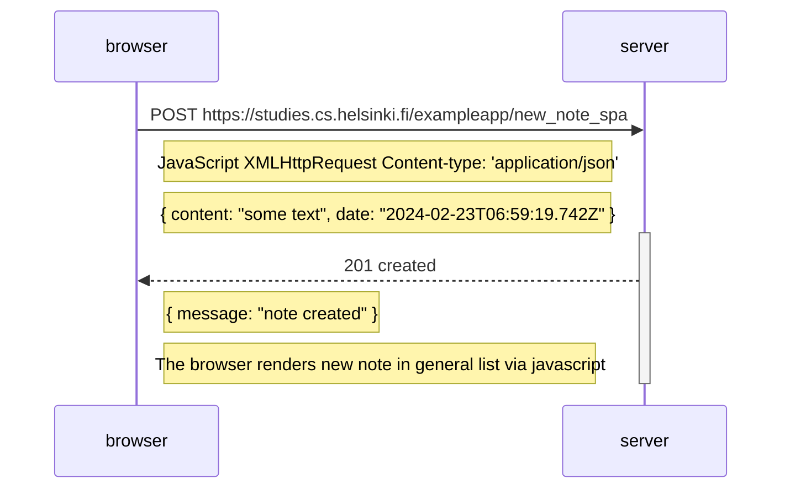

```mermaid
sequenceDiagram
    participant browser
    participant server

    browser->>server: POST https://studies.cs.helsinki.fi/exampleapp/new_note_spa
    Note right of browser: JavaScript XMLHttpRequest Content-type: 'application/json' 
    Note right of browser: { content: "some text", date: "2024-02-23T06:59:19.742Z" }
    activate server
    server-->>browser: 201 created
    Note right of browser: { message: "note created" }
    Note right of browser: The browser renders new note in general list via javascript
    deactivate server
```